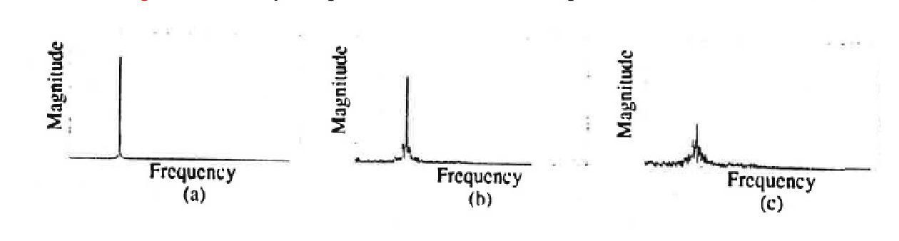
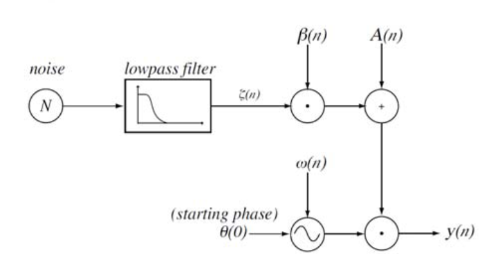

# Bandwidth Enhanced Oscillator

A **bandwidth enhanced oscillator (BEO)** is a [[sine-wave|sine wave]] [[oscillator]] that has been modified to allow the introduction of variable [[noise]] bandwidth.

BEOs are used in [[spectral-modeling-synthesis|spectral modeling synthesis]] after [[mcaulay-quatieri-algorithm|MQ]] analysis to generate both [[harmonic-series|harmonic]] and [[inharmonicity|inharmonic]] components.

In SMS with BEOs, each BEO generates a [[partial]] with four parameters:

- [[amplitude]] [[envelope]]
- [[frequency]] envelope
- bandwidth envelope
- starting [[phase]] (usually computed to result in a desired phase value at end of [[transient]])

The use of BEOs has several benefits in SMS:

- high fidelity [[sound-synthesis]] for breathy and [[transient]] sounds; more accurate than standalone noise generators
- **homogeneity** of model promises greater control over voice quality modifications
- easier to manipulate sinusoidal and noise components together
- less expensive than using additional oscillators

## Bandwidth Envelope

The bandwidth envelope $\beta(n)$ controls "noisiness" (how much energy from the partial is spread to nearby frequencies) by multiplying the amplitude envelope of a partial by a variable amount of narrowband noise.

## Application

## Sources

- <https://citeseerx.ist.psu.edu/viewdoc/download?doi=10.1.1.21.7012&rep=rep1&type=pdf>

[//begin]: # "Autogenerated link references for markdown compatibility"
[sine-wave|sine wave]: sine-wave "Sine wave"
[oscillator]: oscillator "Oscillator"
[noise]: noise "Noise"
[spectral-modeling-synthesis|spectral modeling synthesis]: spectral-modeling-synthesis "Spectral Modeling Synthesis"
[mcaulay-quatieri-algorithm|MQ]: mcaulay-quatieri-algorithm "McAulay-Quatieri Algorithm"
[harmonic-series|harmonic]: harmonic-series "Harmonic Series"
[inharmonicity|inharmonic]: inharmonicity "Inharmonicity"
[partial]: partial "Partial"
[amplitude]: amplitude "Amplitude"
[envelope]: envelope "Envelope"
[frequency]: frequency "Frequency"
[phase]: phase "Phase"
[transient]: transient "Transient"
[sound-synthesis]: sound-synthesis "Sound Synthesis"
[//end]: # "Autogenerated link references"
