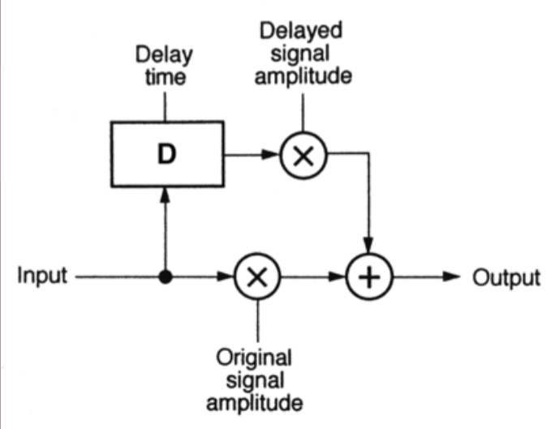

# Digital Delay Line

A **digital delay line (DDL)** is a type of [[audio-signal|audio signal]] processing that digitally implements a [[delay-line|delay line]]. It stores a sequence of [[sampling-signal-processing|audio samples]] in memory and outputs them after a period of time.

- can be _any_ period of time

Mixing delayed output with input produces a variety of effects:

- echo
- [[multi-tap-delay|multi-tap delay]]
- [[comb-filter|comb filters]] & resonators
- [[phaser|phasing]] & [[flanger|flanging]]
- [[chorus]]
- [[pitch-shifting-realtime|pitch-shifting and harmonization]]
- [[reverb|reverberation]], simulation of room acoustics

These effects are split between [[fixed-delay-effects|fixed delays]] and [[variable-delay-effects|variable delays]].

## Analog vs Digital Delay Lines

Analog delay:

- implemented via reel-to-reel tape deck
- delay time determined by tape speed & physical distance between record/play heads
- multiple delays possible with multiple play heads and/or multiple tape decks

Digital Delay:

- any number of samples in length
- quantity and length of delays limited by available memory
- flexible in terms of physical space

## Signal Flow

Basic DDL (inherently stable):

Basic DDL with [[feedback]] (unstable if delayed signal [[amplitude]] > 1):

## Delays in Parallel/Series

**Parallel**: multiple copies are individually sent through multiple delays; outputs are summed

**Series**: signal is sent through a succession of delays; input/output are usually mixed at each stage

## Implementation

Uses a [[circular-queue|circular queue]] or **circular buffer**

- a block of memory are treated as if the end and beginning are connected (visually a circle)
- list of sequential memory locations for audio samples
- has a **write pointer** at and least one **read pointer**
- read pointer also called a **tap**
- pointers advance through a buffer, R lags behind W by # of samples corresponding to delay time
- pointers "wrap" around back to beginning when they reach the end of the queue

## Digital Filters vs. Digital Delays

In terms of design, digital [[filter|filters]] & delays are essentially distinguishable

- delay an input signal by some amount
- mix delayed output with input

Filters require delay/mixing in order to cancel/reinforce certain [[frequency|frequencies]].

Consider a simple [[low-pass-filter|lowpass filter]]:

$$y[n] = 0.5 \times x[n] + 0.5 \times x[n-1]$$

- `x` = input signal
- `y` = output signal
- `n` = sample index
- `x[n]` = input signal at `n`th sample
- `y[n]` = output signal at `n`th sample

Performs averaging function on consecutive sample pairs

Creates a slight smoothing effect on [[waveform]] shape, thus attenuating higher frequencies.

For a waveform at [[nyquist-frequency|Nyquist frequency]], waveform will be completely nullified (consecutive samples are equal and opposite, yielding a zero average)

Longer-term averaging function (ten incremental sample delays in parallel) creates a stronger smoothing effect, lowering the [[cutoff-frequency|cutoff frequency]]:

$$y[n] = 0.1 \times x[n] + 0.1 \times x[n-1] + ... + 0.1 \times x[n-9]$$

Digital filters and digital delays are closely related in design and result:

- some types of delay lines can noticeably affect a sound's [[spectrum]]
- some filters can introduce [[phase]]/timing shifts
  - capable of smearing [[transient|transients]]

General naming distinction:

- delay time measured in [[sampling-signal-processing|samples]] → **filter**
- delay time measured in seconds/milliseconds → **delay line**
  - related to [[linear-superposition|linear superposition]] and related [[wave-interference]] properties

## Sources

- <https://ccrma.stanford.edu/~jos/pasp/Delay_Lines.html>

[//begin]: # "Autogenerated link references for markdown compatibility"
[audio-signal|audio signal]: audio-signal "Audio Signal"
[delay-line|delay line]: delay-line "Delay Line"
[sampling-signal-processing|audio samples]: sampling-signal-processing "Sampling (Signal Processing)"
[multi-tap-delay|multi-tap delay]: multi-tap-delay "Multi-Tap Delay"
[comb-filter|comb filters]: comb-filter "Comb Filter"
[phaser|phasing]: phaser "Phaser"
[flanger|flanging]: flanger "Flanger"
[chorus]: chorus "Chorus"
[pitch-shifting-realtime|pitch-shifting and harmonization]: pitch-shifting-realtime "Pitch-Shifting/Harmonization"
[reverb|reverberation]: reverb "Reverb"
[fixed-delay-effects|fixed delays]: fixed-delay-effects "Fixed Delay Effects"
[variable-delay-effects|variable delays]: variable-delay-effects "Variable Delay Effects"
[localization]: localization "Localization"
[feedback]: feedback "Feedback"
[amplitude]: amplitude "Amplitude"
[circular-queue|circular queue]: circular-queue "Circular Queue"
[filter|filters]: filter "Filter"
[frequency|frequencies]: frequency "Frequency"
[low-pass-filter|lowpass filter]: low-pass-filter "Low pass filter"
[waveform]: waveform "Waveform"
[nyquist-frequency|Nyquist frequency]: nyquist-frequency "Nyquist Frequency"
[cutoff-frequency|cutoff frequency]: cutoff-frequency "Cutoff frequency"
[spectrum]: spectrum "Spectrum"
[phase]: phase "Phase"
[transient|transients]: transient "Transient"
[sampling-signal-processing|samples]: sampling-signal-processing "Sampling (Signal Processing)"
[linear-superposition|linear superposition]: linear-superposition "Linear Superposition"
[wave-interference]: wave-interference "Wave Interference"
[//end]: # "Autogenerated link references"
