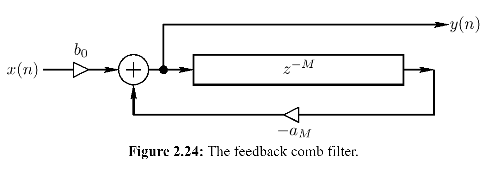

# Feedback comb filter

The **feedback comb filter** uses feedback in its design as opposed to a feedforward signal like its counterpart.

The feedback comb filter is an example of an [[infinite-impulse-response|IIR]] digital [[filter]]. It can be regarded as a computational physical model of a _series_ of echoes.

## Sources

- <https://ccrma.stanford.edu/~jos/pasp/Feedback_Comb_Filters.html>

[//begin]: # "Autogenerated link references for markdown compatibility"
[infinite-impulse-response|IIR]: infinite-impulse-response "Infinite impulse response (IIR)"
[filter]: filter "Filter"
[//end]: # "Autogenerated link references"
