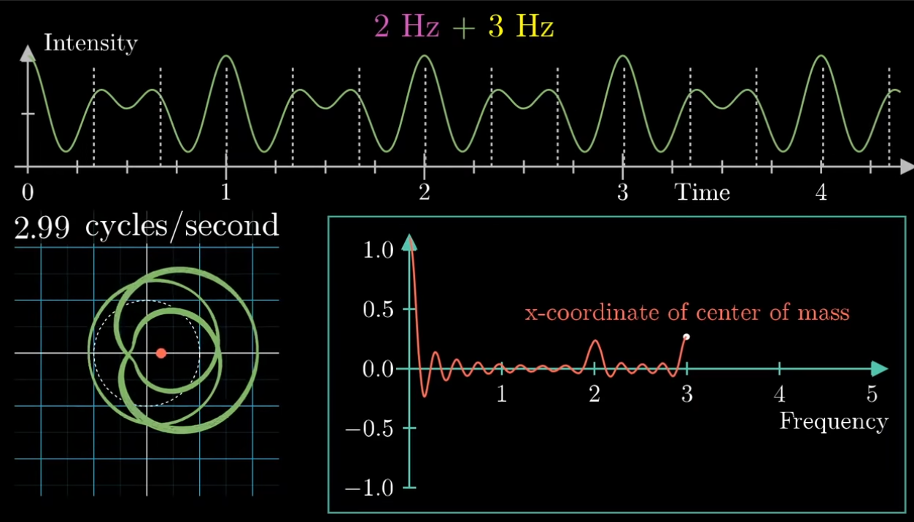

# Fourier Transform

A **Fourier Transform** is a mathematical tool for _frequency decomposition_, used to decompose a signal into its pure, single-frequency components.

In practice, Fourier transforms are often used with [[fourier-inversion-theorem|inverse Fourier transforms]]: reproducing a signal (intensity over time) _from_ a Fourier Transform (intensity in terms of frequency)

The Fourier transform of an intensity vs. time graph, usually $g(t)$, is a new function $\hat{g}(t)$, which:

- doesn't have time as an input, but instead takes a _frequency_ (the "winding" frequency)
- outputs a complex number, some point in the 2D plane, that corresponds to the strength of a given frequency in the original signal

$$
\hat{g}(f) = \int^{t^2}_{t_1}g(t)e^{-2 \pi i f t} dt
$$

Key concepts for understanding this function:

- exponentials correspond to rotation (Euler's number)
- multiplying the exponential by the original input $g(t)$ means drawing a wound up version of that graph around the origin
- an integral of a complex valued function can be interpreted in terms of a center-of-mass idea

## Sound

Fourier transforms are used in [[spectral-analysis|spectral analysis]] to decompose and isolate [[frequency|frequencies]] from [[sound-waves|sound]].

## Sources

- [But what is the Fourier Transform? A visual introduction (YouTube)](https://www.youtube.com/watch?v=spUNpyF58BY)

[//begin]: # "Autogenerated link references for markdown compatibility"
[fourier-inversion-theorem|inverse Fourier transforms]: fourier-inversion-theorem "Fourier Inversion Theorem"
[spectral-analysis|spectral analysis]: spectral-analysis "Spectral Analysis"
[frequency|frequencies]: frequency "Frequency"
[sound-waves|sound]: sound-waves "Sound Waves"
[//end]: # "Autogenerated link references"
