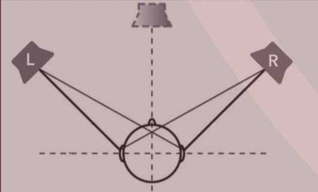

# Localization

If two equidistant [[loudspeakers]] reproduce the same [[audio-signal|signal]], source "image" appears in-between.

- if one speaker is louder than the other, sense of direction shifts
- if a small [[digital-delay-line|delay]] is introduced in `L`, perceived image shifts towards `R`
  - delayed signal is interpreted as environmental echo, reinforcing perceived location of earlier sound
- [[psychoacoustics|psychoacoustic]] principle called **Precedence Effect** or **Haas Effect**

[//begin]: # "Autogenerated link references for markdown compatibility"
[loudspeakers]: loudspeakers "Loudspeakers"
[audio-signal|signal]: audio-signal "Audio Signal"
[digital-delay-line|delay]: digital-delay-line "Digital Delay Line"
[psychoacoustics|psychoacoustic]: psychoacoustics "Psychoacoustics"
[//end]: # "Autogenerated link references"
