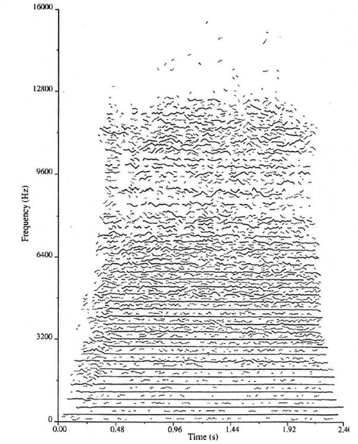

# McAulay-Quatieri Algorithm

The **McAulay-Quatieri (MQ)** algorithm is an [[algorithm]] that converts a [[sound-waves|sound]] into a collection of sinusoidal components ([[sine-wave|sine waves]]), each with their own [[amplitude]] and [[frequency]] [[envelope]]. This collection can be used by a [[sound-synthesis|synthesis]] engine to recreate the source sound as closely as possible.

- a method of [[frequency-decomposition|frequency decomposition]] used in [[long-window-time-varying-spectral-analysis|long window spectral analysis]]
- each sine wave component is called a "track"
- each track is computed using a [[fast-fourier-transform|FFT]] or [[short-time-fourier-transform|STFT]]

Compared to other [[spectral-analysis|spectral analysis]] techniques:

- uniquely capable of analyzing sounds without a stable [[harmonic-series|harmonic structure]], i.e. polyphonic or [[inharmonicity|inharmonic]] sounds, instrument tones with large vibrato
- provides information to control a real-time [[additive-synthesis|additive synthesis]] engine
- by default, generates an arbitrary number of sinusoidal tracks

## Common Analysis Procedure

1. Select [[kaiser-window|Kaiser Window]] parameters: **length** ($N$) and **shape** ($\alpha$)
   - $N$ is usually 50-300 ms
   - select **hop size** (usually ~3 ms)
   - Modification: _express Kaiser Window equations in terms of more musically useful parameters_
     - Main Lobe Width: minimum frequency separation between partials
     - Side Lobe Attenuation: usually around -90 dB
   - Different sounds have different trade-offs between these parameters
2. Window and FFT the [[audio-signal|signal]]. Keep only peaks in [[spectrum]]: for each peak, store the bin frequency, magnitude, and [[phase]].
   - Modification: _improve frequency estimate of each peak_
     - use [[quadratic-interpolation|quadratic phase interpolation]] draw vertical parabola through peak magnitude and its left and right neighbor ("Smith Interpolation")
     - improved frequency estimate is at the top of parabola
3. Create [[partial]] frequency envelopes by stringing together peaks from consecutive FFTs
   - Handle birth of new partials and death of old partials (involves many threshold and hysteresis parameters)
   - Avoid crossing partials and audible, low-amplitude tracks quickly being born and dying (coined as "doodley-doo" artifacts), etc.
     - [[hysteresis]] parameters used to prevent "doodley-doos", improving quality of synthesis without demanding additional oscillators
4. Perform additive sine wave synthesis
   - [[amplitude]] envelope: use [[linear-interpolation|linear interpolation]] between magnitude values
   - phase: use [[quadratic-interpolation|quadratic phase interpolation]] by matching phase and bin frequency at each peak
   - frequency envelope: determined by phase computation
   - Modification: _better frequency synthesis approach_
     - obtain frequency envelope through linear interpolation of improved frequency estimates from modified step 2
     - obtain phase information through frequency computation. The synthesized phase will _not_ match the analyzed phase (same kind of [[sound-synthesis|synthesis]] for [[short-window-time-varying-spectral-analysis|short window analysis]])

## Sources

- <https://citeseerx.ist.psu.edu/viewdoc/download?doi=10.1.1.21.8075&rep=rep1&type=pdf>

[//begin]: # "Autogenerated link references for markdown compatibility"
[algorithm]: algorithm "Algorithm"
[sound-waves|sound]: sound-waves "Sound Waves"
[sine-wave|sine waves]: sine-wave "Sine wave"
[amplitude]: amplitude "Amplitude"
[frequency]: frequency "Frequency"
[envelope]: envelope "Envelope"
[sound-synthesis|synthesis]: sound-synthesis "Sound Synthesis"
[frequency-decomposition|frequency decomposition]: frequency-decomposition "Frequency Decomposition"
[long-window-time-varying-spectral-analysis|long window spectral analysis]: long-window-time-varying-spectral-analysis "Long Window Time-Varying Spectral Analysis"
[fast-fourier-transform|FFT]: fast-fourier-transform "Fast Fourier Transform"
[short-time-fourier-transform|STFT]: short-time-fourier-transform "Short-time Fourier Transform"
[spectral-analysis|spectral analysis]: spectral-analysis "Spectral Analysis"
[harmonic-series|harmonic structure]: harmonic-series "Harmonic Series"
[inharmonicity|inharmonic]: inharmonicity "Inharmonicity"
[additive-synthesis|additive synthesis]: additive-synthesis "Additive Synthesis"
[kaiser-window|Kaiser Window]: kaiser-window "Kaiser Window"
[audio-signal|signal]: audio-signal "Audio Signal"
[spectrum]: spectrum "Spectrum"
[phase]: phase "Phase"
[quadratic-interpolation|quadratic phase interpolation]: quadratic-interpolation "Quadratic Interpolation"
[partial]: partial "Partial"
[hysteresis]: hysteresis "Hysteresis"
[linear-interpolation|linear interpolation]: linear-interpolation "Linear Interpolation"
[short-window-time-varying-spectral-analysis|short window analysis]: short-window-time-varying-spectral-analysis "Short Window Time-Varying Spectral Analysis"
[//end]: # "Autogenerated link references"
