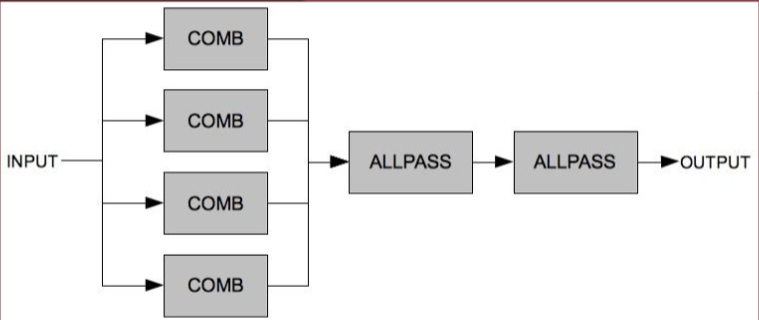

# Reverb

**Reverb**, or _reverberation_, is a [[fixed-delay-effects|fixed delay effect]] where many delay lines work together to simulate reflections of a sound source in order to simulate room/hall acoustics.

- numerous reverb [[algorithm|algorithms]] in existence
- usually, a large combination of [[feedback]] delays with different short/medium delay times, in parallel and series

Delay times usually do not vary dynamically

- because room dimensions do not vary dynamically!
- variable delay times can be used for doppler effect and other weird, custom reverb-like effects

Many reverb algorithms are variations on the **Schroeder Reverb** design:

- 4 summed [[comb-filter|comb filters]] in parallel, through two [[all-pass-filter|all-pass filters]] in series
- comb filters provide reverb "body"
  - delay lines with [[feedback]]
- [[all-pass-filter|all-pass filters]] introduce [[frequency]]-specific [[phase]] shifts to diffuse the sound and reduce [[resonance]]

[//begin]: # "Autogenerated link references for markdown compatibility"
[fixed-delay-effects|fixed delay effect]: fixed-delay-effects "Fixed Delay Effects"
[algorithm|algorithms]: algorithm "Algorithm"
[feedback]: feedback "Feedback"
[comb-filter|comb filters]: comb-filter "Comb Filter"
[all-pass-filter|all-pass filters]: all-pass-filter "All-Pass Filter"
[frequency]: frequency "Frequency"
[phase]: phase "Phase"
[resonance]: resonance "Resonance"
[//end]: # "Autogenerated link references"
