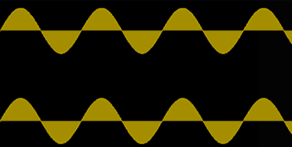

# Sine wave

A **sine wave** is the purest form of vibrational motion, also called simple harmonic motion.

The [[spectrum]] of a sine wave consists of the [[fundamental]] [[partial]] alone. All complex vibrations are comprised of sine waves at different [[amplitude]]s by the [[fourier-theorem|Fourier theorem]].

[[sine-generator|Sine generators]] are used when [[sound-synthesis|synthesizing]] sine waves [[audio-signal|audio signals]].

## Sources

- [MUS 407 Sound, Acoustics, & Psychoacoustics](https://prezi.com/view/ZcqvwosFJCFJQtQrbP75/)
- ["Wavetable Synthesis Algorithm Explained", Jan Wilczek (WolfSound)](https://www.thewolfsound.com/sound-synthesis/wavetable-synthesis-algorithm/)

[//begin]: # "Autogenerated link references for markdown compatibility"
[spectrum]: spectrum "Spectrum"
[fundamental]: fundamental "Fundamental"
[partial]: partial "Partial"
[amplitude]: amplitude "Amplitude"
[fourier-theorem|Fourier theorem]: fourier-theorem "Fourier Theorem"
[sine-generator|Sine generators]: sine-generator "Sine Generator"
[sound-synthesis|synthesizing]: sound-synthesis "Sound Synthesis"
[audio-signal|audio signals]: audio-signal "Audio Signal"
[//end]: # "Autogenerated link references"
