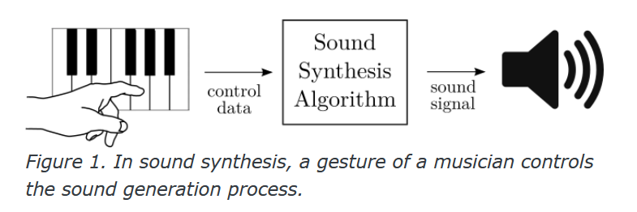

# Sound Synthesis

**Sound synthesis** is the process of creating [[sound-waves|sound]], either by generating it from scratch or using existing sonic material.

Synthesis is often facilitated by using [[synthesizer|synthesizers]], either [[analog-synthesizers|analog]] or [[digital-synthesizers|digital]].

In sound synthesis, complex waves are generated by [[algorithm]]s of some type:

- [[additive-synthesis|Additive Synthesis]]
- [[subtractive-synthesis|Subtractive Synthesis]]
- [[modulation-synthesis|Modulation Synthesis]]
  - [[ring-modulation|Ring Modulation]]
  - [[frequency-modulation|Frequency Modulation]]
  - [[amplitude-modulation|Amplitude Modulation]]
- Karplus Strong
  - Loading up a buffer of [[noise]] and [[filter|filtering]] it
- [[granular-synthesis|Granular Synthesis]]
- Physical Modeling
- [[wavetable-synthesis|Wavetable synthesis]]

[[spectral-composition|Spectral composers]] adapt these synthesis techniques to compute 'symbolic [[spectrum|spectra]]' ([[pitch]] sets) rather than, or in addition to, [[audio-signal|audio signals]].

## Gesture to Sound

A "musician's gesture" is any action that sends control data to some sound synthesis engine or [[algorithm]], from which an [[audio-signal|audio signal]] is produced.

- MIDI controllers send control data in the form of [[midi-message-format|MIDI messages]]
- at minimum, synthesizer can convert information into a [[frequency]] $f$ and [[amplitude]] $A$, which is usually enough information to generate sound

## Sources

- MUS 305 Lecture
- MUS 407
- ["Wavetable Synthesis Algorithm Explained", Jan Wilczek (WolfSound)](https://www.thewolfsound.com/sound-synthesis/wavetable-synthesis-algorithm/)

[//begin]: # "Autogenerated link references for markdown compatibility"
[sound-waves|sound]: sound-waves "Sound Waves"
[synthesizer|synthesizers]: synthesizer "Synthesizer"
[analog-synthesizers|analog]: analog-synthesizers "Analog Synthesizers"
[digital-synthesizers|digital]: digital-synthesizers "Digital Synthesizers"
[algorithm]: algorithm "Algorithm"
[additive-synthesis|Additive Synthesis]: additive-synthesis "Additive Synthesis"
[subtractive-synthesis|Subtractive Synthesis]: subtractive-synthesis "Subtractive Synthesis"
[modulation-synthesis|Modulation Synthesis]: modulation-synthesis "Modulation Synthesis"
[ring-modulation|Ring Modulation]: ring-modulation "Ring Modulation"
[frequency-modulation|Frequency Modulation]: frequency-modulation "Frequency Modulation"
[amplitude-modulation|Amplitude Modulation]: amplitude-modulation "Amplitude Modulation"
[noise]: noise "Noise"
[filter|filtering]: filter "Filter"
[granular-synthesis|Granular Synthesis]: granular-synthesis "Granular Synthesis"
[wavetable-synthesis|Wavetable synthesis]: wavetable-synthesis "Wavetable Synthesis"
[spectral-composition|Spectral composers]: spectral-composition "Spectral Composition"
[spectrum|spectra]: spectrum "Spectrum"
[pitch]: pitch "Pitch"
[audio-signal|audio signals]: audio-signal "Audio Signal"
[audio-signal|audio signal]: audio-signal "Audio Signal"
[midi-message-format|MIDI messages]: midi-message-format "MIDI Message Format"
[frequency]: frequency "Frequency"
[amplitude]: amplitude "Amplitude"
[//end]: # "Autogenerated link references"s"
