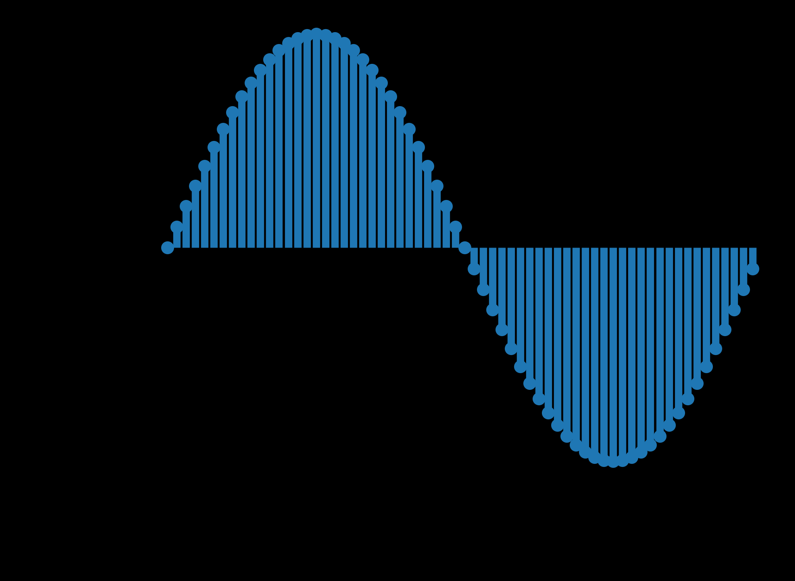

# Waveform

A **waveform** refers to

- a plot of a signal over the [[time-domain|time domain]]
- a graphical depiction of pressure changes at a point in space over time
  - depicts _pressure / time_
  - regular pattern of pressure variations, exhibiting a loss of energy over time

Example: a digital [[sine-wave|sine]] waveform

## Types

Within audio, the term "waveform" refers to several fundamental types of waves that are usually depicted within the time domain:

- [[sine-wave|sine waves]]
- [[square-wave|square waves]]
- [[triangle-wave|triangle waves]]
- [[sawtooth-wave|sawtooth waves]]

## Sources

- ["Wavetable Synthesis Algorithm Explained", Jan Wilczek (WolfSound)](https://www.thewolfsound.com/sound-synthesis/wavetable-synthesis-algorithm/)

[//begin]: # "Autogenerated link references for markdown compatibility"
[time-domain|time domain]: time-domain "Time Domain"
[sine-wave|sine]: sine-wave "Sine wave"
[sine-wave|sine waves]: sine-wave "Sine wave"
[square-wave|square waves]: square-wave "Square Wave"
[triangle-wave|triangle waves]: triangle-wave "Triangle wave"
[sawtooth-wave|sawtooth waves]: sawtooth-wave "Sawtooth wave"
[//end]: # "Autogenerated link references"
