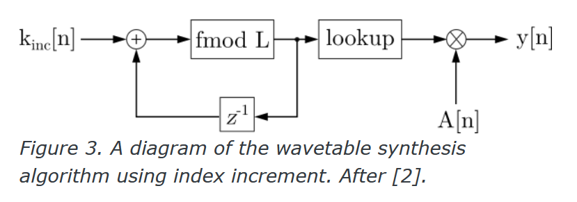

# Wavetable Synthesis

**Wavetable synthesis** is a method of [[digital-audio|digital]] [[sound-synthesis|sound synthesis]] that pre-computes values of a [[waveform]] and stores them into a [[wave-table|wave table]].

- saves computation time and improves [[runtime]] by storing values of a waveform, rather than computing them for each [[sampling-signal-processing|sample]]

Below is a diagram of a wavetable synthesizer:

Diagram explanation:

- $k_{inc}[n]$ is the [[index-increment|index increment]], directly dependent on [[frequency]] (determined by some controller)
  - when no sound is played, $k_{inc}[n]$ is 0
- for each new output sample, index increment is added to some `index` variable stored in a single-sample buffer, $z^{-1}$
- index is kept into the range of wavetable indices $[0, L)$ using `fmod` (resulting in index/[[phase]] wrap)
- then, [[wave-table-lookup|lookup]] is performed using the computed index, using some interpolation strategy of choice
- finally, the signal is multiplied by some sample-dependent [[amplitude]] value $A[n]$, called the amplitude [[envelope]]
- output is represented by $y[n]$

## Sources

- ["Wavetable Synthesis Algorithm Explained", Jan Wilczek (WolfSound)](https://www.thewolfsound.com/sound-synthesis/wavetable-synthesis-algorithm/)

[//begin]: # "Autogenerated link references for markdown compatibility"
[digital-audio|digital]: digital-audio "Digital Audio"
[sound-synthesis|sound synthesis]: sound-synthesis "Sound Synthesis"
[waveform]: waveform "Waveform"
[wave-table|wave table]: wave-table "Wave Table"
[runtime]: runtime "Runtime"
[sampling-signal-processing|sample]: sampling-signal-processing "Sampling (Signal Processing)"
[index-increment|index increment]: index-increment "Index increment"
[frequency]: frequency "Frequency"
[phase]: phase "Phase"
[wave-table-lookup|lookup]: wave-table-lookup "Wave table lookup"
[amplitude]: amplitude "Amplitude"
[envelope]: envelope "Envelope"
[//end]: # "Autogenerated link references"
