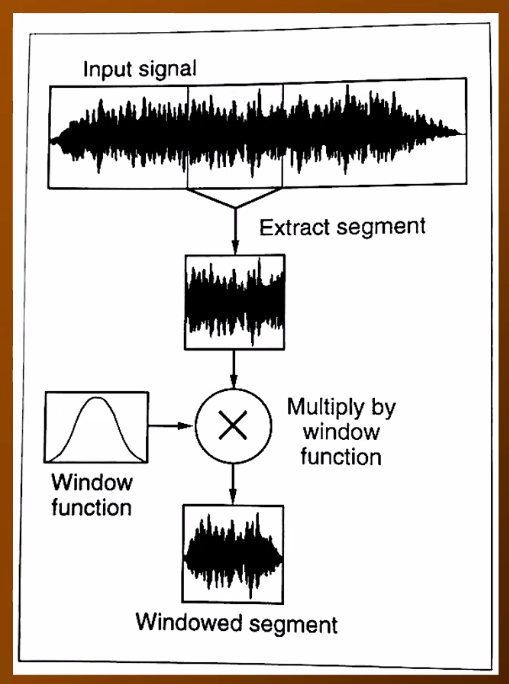

# Windowing

**Windowing** is the process of applying an [[amplitude]] [[envelope]] to a portion of a signal (in our case, an [[audio-signal|audio signal]]).

## Sources

- MUS 409

[//begin]: # "Autogenerated link references for markdown compatibility"
[amplitude]: amplitude "Amplitude"
[envelope]: envelope "Envelope"
[audio-signal|audio signal]: audio-signal "Audio Signal"
[//end]: # "Autogenerated link references"